# Spring — an Omarchy theme 🌸

The spring companion to [Autumn](https://github.com/SirJul1337/omarchy-autumn-theme):
a dark theme with spring in its colors — deep moss background, sage
foreground, and accents of fresh leaf green, blossom pink, and sky blue.


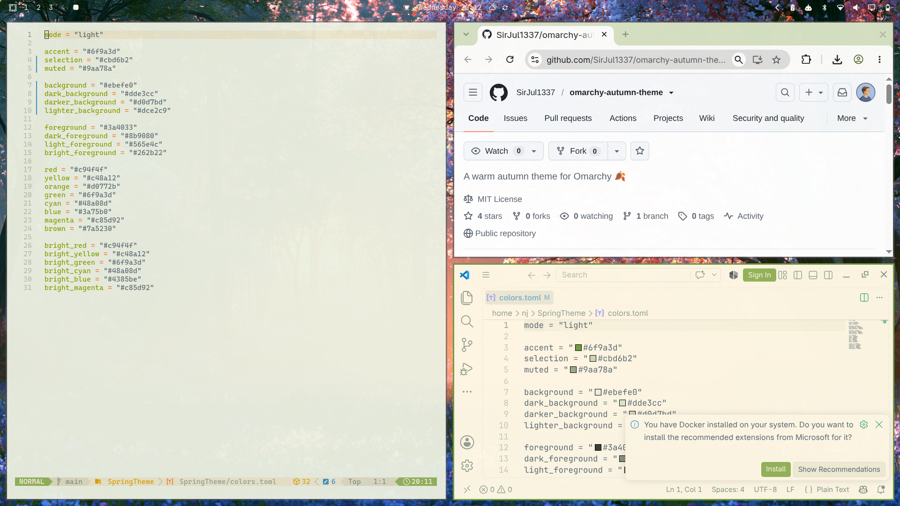

## Install

```bash
omarchy theme install https://github.com/SirJul1337/omarchy-spring-theme.git
```

That's it — the theme is applied immediately as **Spring**.

## What's included

- **Colors** — dark-mode `colors.toml` driving the bar, terminals, notifications, and apps
- **Backgrounds** — nine spring landscapes plus a blossom-bokeh wallpaper
- **Neovim** — [Everforest](https://github.com/sainnhe/everforest) (dark, soft)
- **VS Code** — Everforest Dark
- **Icons** — Yaru-sage

## Backgrounds

Ten wallpapers included — cycle with `omarchy theme bg next`.

| | |
|---|---|
| 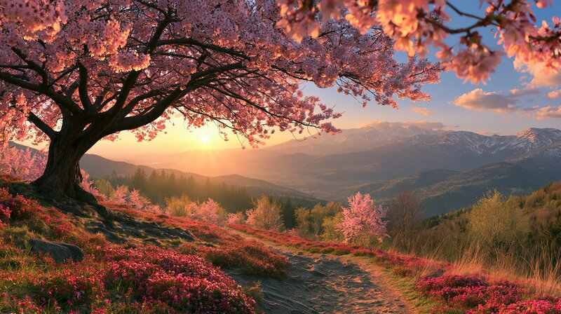 | 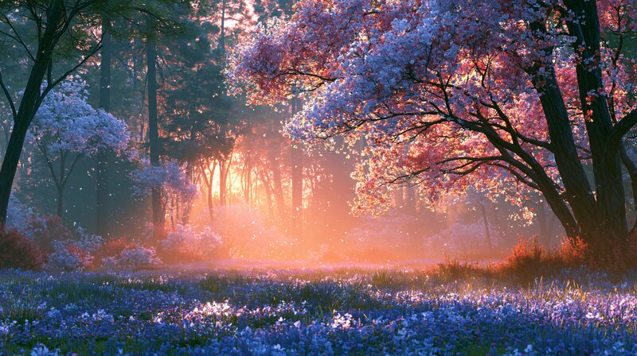 |
| 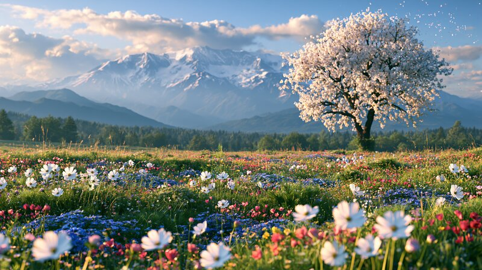 | 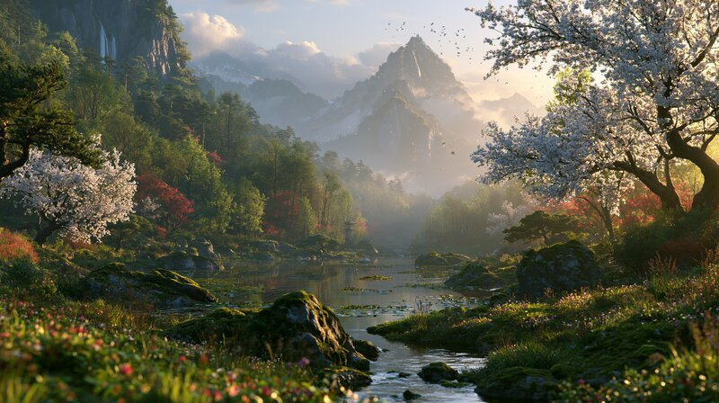 |
| 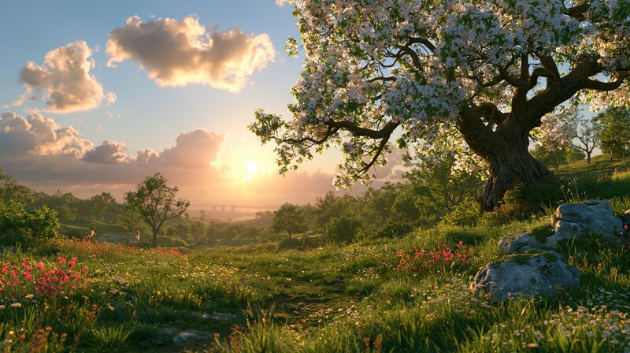 | 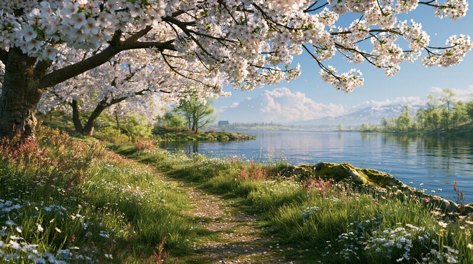 |
| 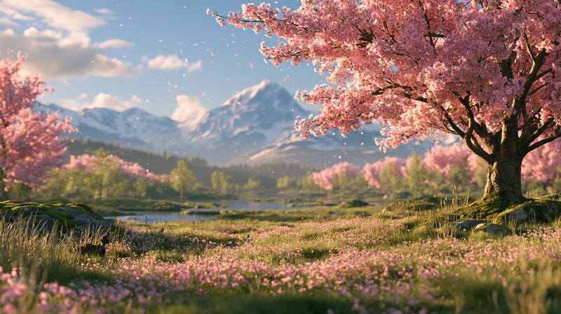 | 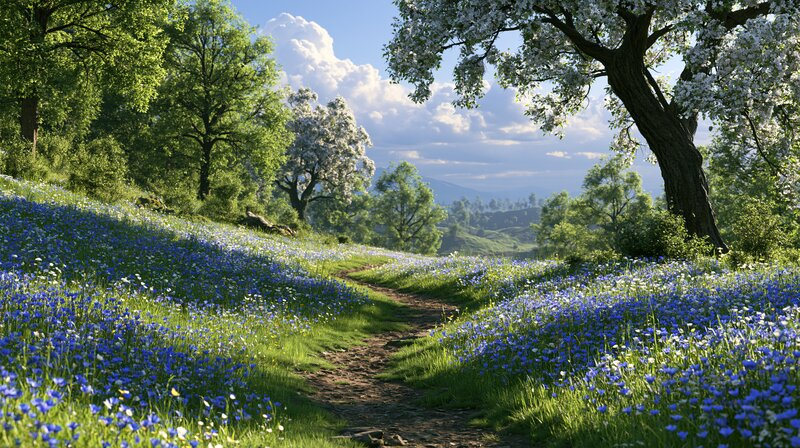 |
| 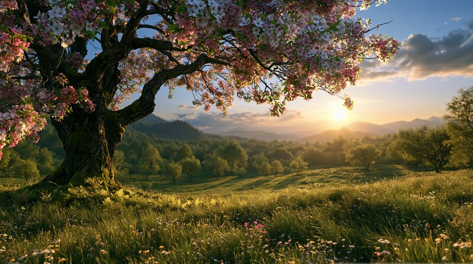 | 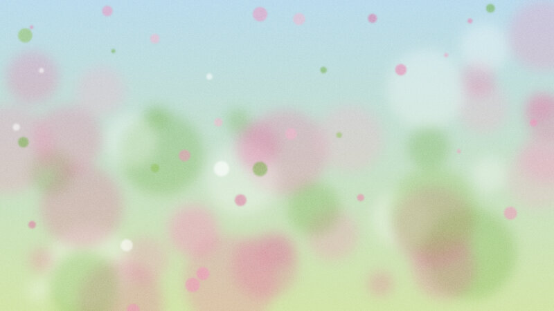 |
